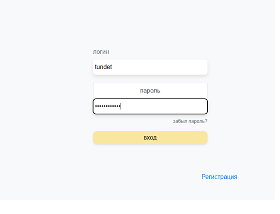
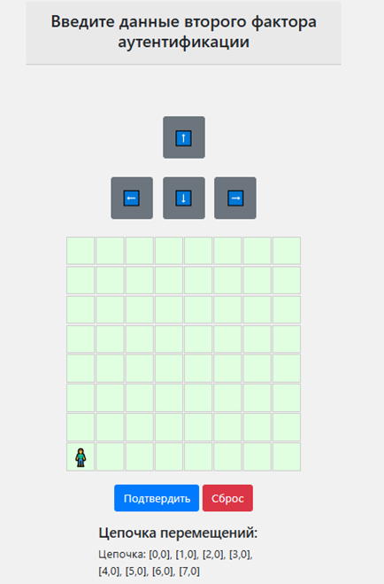

# Alter Authentication

**Alter Authentication** — это система двухфакторной аутентификации, обеспечивающая дополнительный уровень безопасности для веб-ресурсов. Подходит для корпоративных сетей, интернет-магазинов и других веб-приложений, требующих надежной защиты данных.

## 🎯 Для кого этот проект
- Разработчики, изучающие Django и многофакторную аутентификацию.
- Администраторы, настраивающие аутентификацию для своих систем.
- Исследователи, которые хотят понять, как работают графические тесты в безопасности.

## 📋 Описание

Проект предоставляет следующие функции:
- Двухфакторная аутентификация (OTP, Quiz, графический тест).
- Реализация через Django Framework.
- Инфраструктура на базе Docker (PostgreSQL, Nginx, Django).
- Мини-игра для графического теста в виде сетки 8x8.

## 🚀 Быстрый старт

### 1. Требования
- Установленный Docker версии **20.10+**.
- Git для клонирования проекта.
- Python **3.8+** (если вы не хотите использовать Docker).

### 2. Клонирование репозитория

```bash
git clone https://github.com/sunproggit1/Alter_authentication.git
cd Alter_authentication
```
3. Настройка .env
Создайте файл .env в корневой папке проекта и добавьте следующие переменные:
SECRET_KEY: секретный ключ Django.
DB_NAME, DB_USER, DB_PASS: настройки PostgreSQL.
EMAIL_HOST_USER, EMAIL_HOST_PASSWORD: данные для отправки почты.

#### Зачем нужен `SECRET_KEY`?

`SECRET_KEY` используется Django для:
- Подписи cookies и токенов.
- Шифрования данных в системе аутентификации.

Каждое развертывание должно иметь уникальный ключ, поэтому не рекомендуется использовать ключ, хранящийся в репозитории.

### Генерация `SECRET_KEY`

В проекте Django используется секретный ключ для шифрования данных. Если ключ отсутствует, выполните следующую команду для его генерации:

```bash
python -c "from django.core.management.utils import get_random_secret_key; print(get_random_secret_key())"
```
Скопируйте сгенерированный ключ и добавьте его в .env файл:

SECRET_KEY='ваш_сгенерированный_секретный_ключ'

### **2. Обновите `.env`**

Убедитесь, что в вашем `.env` есть строка:
SECRET_KEY='ВАШ_СЕКРЕТНЫЙ_КЛЮЧ'

Вот как примерно выглядит .env файл:
DB_NAME='имя базы данных'
DB_USER='имя пользователя'
DB_PASS='пароль пользователя'

SECRET_KEY='ВАШ_СЕКРЕТНЫЙ_КЛЮЧ' 
DEBUG=TRUE
DJANGO_ALLOWED_HOSTS=localhost,localhost:8082,db_alter_auth
DB_NAME='admin'
DB_USER='admin'
DB_PASS='admin'
DB_HOST='db_alter_auth'
DB_PORT='5432'

EMAIL_BACKEND='django.core.mail.backends.smtp.EmailBackend'
EMAIL_HOST='smtp.gmail.com'
EMAIL_PORT=587
EMAIL_USE_TLS=True
EMAIL_HOST_USER='' # Вставьте почту с которой можно пускать рассылки
EMAIL_HOST_PASSWORD=''  # Вставьте сгенерированный пароль почты рассылки
DEFAULT_FROM_EMAIL='' # Вставьте почту с которой можно пускать рассылки

4. Запуск через Docker
Разверните инфраструктуру с помощью Docker Compose:

docker compose up --build

После этого:

Django сервер будет доступен по адресу http://localhost:8001.
Nginx проксирует сервер на http://localhost:8082.

5. Создание суперпользователя
Для доступа к административной панели создайте суперпользователя:

docker exec -it <container_name_web_alter_auth> python manage.py createsuperuser

Замените <container_name_web_alter_auth> на имя вашего контейнера (можно узнать с помощью docker ps).

🛠️ Технологии
Django — Backend.
PostgreSQL — База данных.
Docker — Контейнеризация.
Nginx — Прокси-сервер.
JavaScript (jQuery) — Логика фронтенда.

📂 Структура проекта
alter_authentication/: Код Django приложения.
Dockerfile: Файл для сборки Docker-образа.
docker-compose.yml: Описание сервисов для Docker Compose.
requirements.txt: Зависимости Python.

⚙️ Примечания
Убедитесь, что Docker установлен и работает.
Проверьте, что ваш файл .env заполнен корректно, иначе проект может не запуститься.

🖼️ Скриншоты

Интерфейс логина



Графический тест


